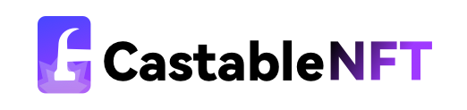

# CaseableNFT Web

## Recommended IDE Setup

- [VSCode](https://code.visualstudio.com/) + [Volar](https://marketplace.visualstudio.com/items?itemName=johnsoncodehk.volar)

## Other needs

- Package Manager: [Yarn](https://yarnpkg.com/)

## Usage

use `yarn` to install dependencies.

use `yarn dev` to run the development server.

use `yarn build` to build the production version.
